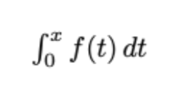

1) #### Базовые операции над структурами данных
   Общее условие:
   Задан набор символов и число n. Опишите функцию, которая возвращает список всех строк длины n,
   состоящих из этих символов и не содержащих двух одинаковых символов, идущих подряд.
   Пример:
   Для символов 'а', 'b', 'c' и n=2 результат должен быть ("ab" "ac" "ba" "bc" "ca" "cb") с точностью до
   перестановки. 

   * Решите задачу с помощью элементарных операций над последовательностями и рекурсии (first, conj, concat, reverse, count, без циклов)
   
   * Перепишите программу 1.1. так, чтобы все рекурсивные вызовы были хвостовыми (first, conj, concat, reverse, count, без циклов)
   * Определить функции my-map и my-filter, аналогичные map (для одного списка) и filter, выразив их через reduce и базовые операции над списками (cons, first, concat и т.п.) 
   * Решите задачу с помощью элементарных операций над последовательностями и функционалов
         map/reduce/filter

2) #### Численное интегрирование
   Общее условие:
   Реализовать функцию (оператор), принимающую аргументом функцию от одной переменной f и
   возвращающую функцию одной переменной, вычисляющую (численно) выражение:

   

    Можно использовать метод трапеций с постоянным шагом.
   При оптимизации исходить из того, что полученная первообразная будет использоваться для
   построения графика (т.е. вызываться многократно в разных точках)

   * Оптимизируйте функцию с помощью мемоизации
   * Оптимизируйте функцию с помощью бесконечной последовательности частичных решений

3. #### Параллельная обработка последовательностей
   * Реализуйте параллельный вариант filter (не обязательно ленивый) с помощью future.
   Параллельная обработка должна производиться блоками по заданному числу элементов. Размер
   блоков следует вычислять вручную, без использования готовых функций, таких как partition (для
   разделения последовательности следует использовать take и drop). Продемонстрируйте прирост
   производительности в сравнении с обычным фильтром.

   * Реализуйте ленивый параллельный filter, который должен работать в том числе с бесконечными
   потоками. Продемонстрируйте прирост производительности в сравнении с обычным фильтром.

4. #### ДНФ
   По аналогии с задачей дифференцирования реализовать представление символьных булевых
   выражений с операциями конъюнкции, дизъюнкции отрицания, импликации. Выражения могут
   включать как булевы константы, так и переменные.
   Реализовать подстановку значения переменной в выражение с его приведением к ДНФ.
   Обеспечить расширяемость для новых операций (исключающее ИЛИ, стрелка Пирса и пр.)
   
    Код должен быть покрыт тестами, API документирован.